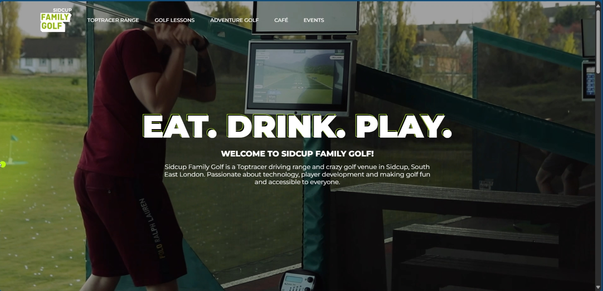
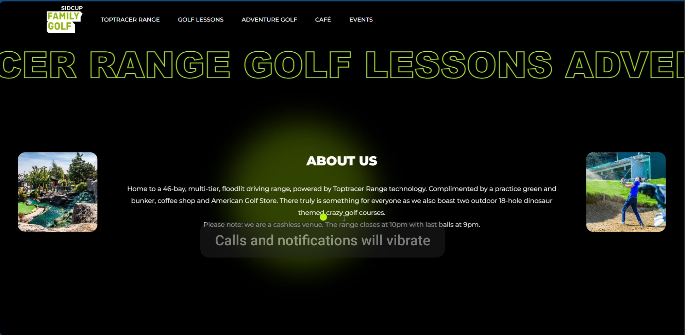
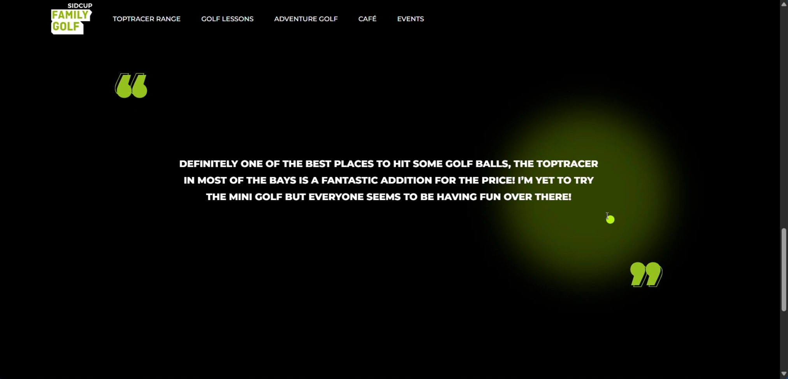
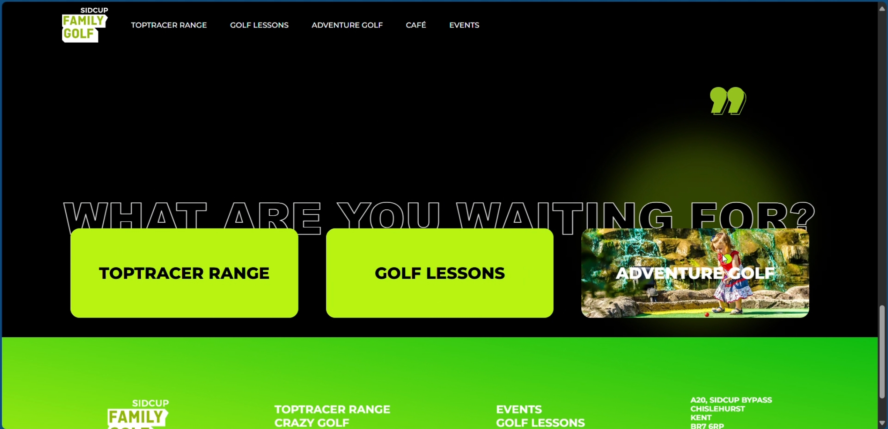

# 🏌️ Sidcup Family Golf – Interactive Website Clone

A responsive front-end clone of the **Sidcup Family Golf** website built using **HTML, CSS, and JavaScript**. This project was created to strengthen my front-end development skills by recreating a modern, animation-rich website with responsive layouts and interactive user experience.

---

## 🌐 Live Demo

🔗 https://khushi1-debug.github.io/sidcup-family-golf-interactive-website-ui/

---

## 📖 About the Project

This project is a front-end clone inspired by the official **Sidcup Family Golf** website. The primary objective was to practice real-world web development concepts such as responsive design, smooth animations, DOM manipulation, and interactive user interfaces using only HTML, CSS, and JavaScript.

> **Note:** This project is built for learning and portfolio purposes only. All design inspiration and branding belong to the original Sidcup Family Golf website.

---

## ✨ Features

- 🎨 Responsive user interface
- ⚡ Smooth scrolling animations
- 🖱️ Interactive hover effects
- 📱 Mobile-friendly layout
- 🌍 Multi-section landing page
- 💻 Clean and organized code structure

---

## 🛠️ Tech Stack

- HTML5
- CSS3
- JavaScript

---

## 📸 Screenshots










---

## 🎥 Demo Video

🎥 Watch the project demo here:

https://[](https://drive.google.com/file/d/1kBRzsxHtr2qOYeuSZ3FNoeqh9dEtwTvd/view?usp=drivesdk)

---

## 🚀 Run Locally

1. Clone the repository

```bash
git clone https://github.com/khushi1-debug/sidcup-family-golf-interactive-website-ui.git
```

2. Open the project folder.

3. Open **index.html** in your browser.

---

## 👩‍💻 Author

**Khushi Yadav**

- GitHub: https://github.com/khushi1-debug

---

⭐ If you like this project, consider giving it a star!
